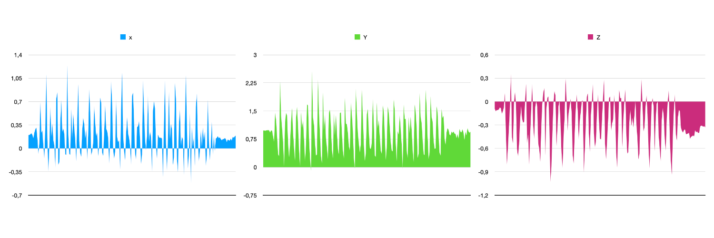
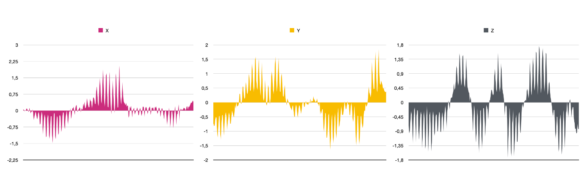
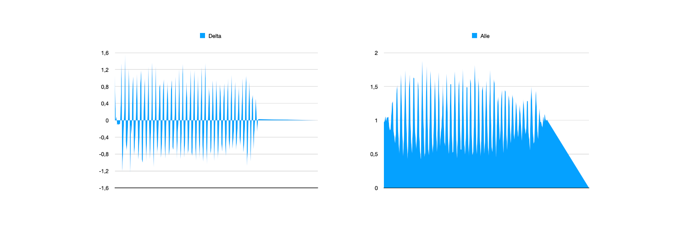
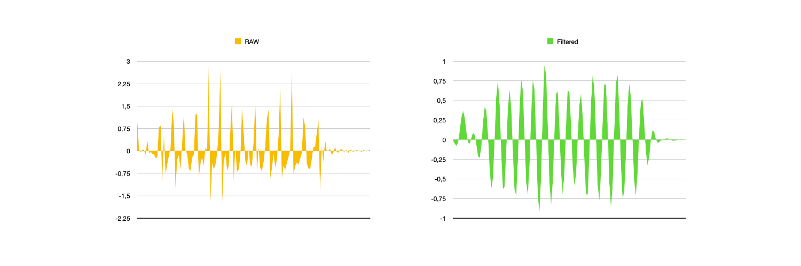
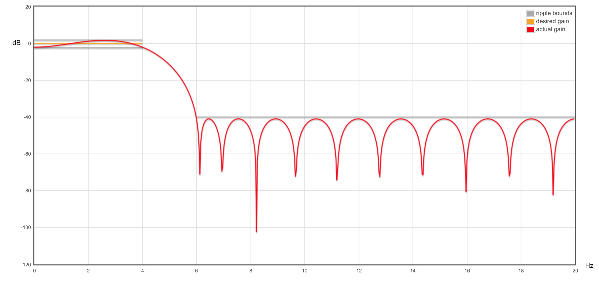
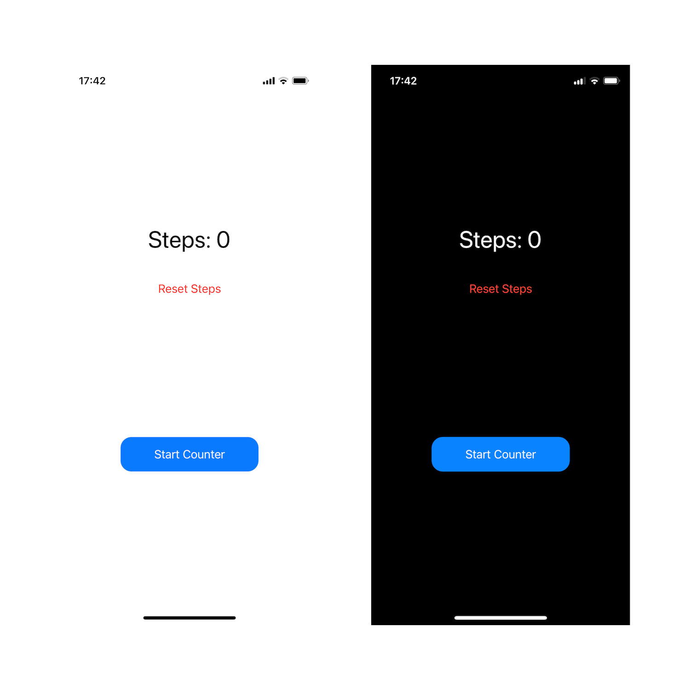

# Pedometer (Step counter)

Pedometer is an iPhone app for counting steps.

## Description

The app uses the CoreMotion framework to get the accelerometer data of the iPhone. It then filters the accelerometer data with a FIR lowpass filter to remove noise from the motion. You can extract the step-counting classes and use them in your own project.

The UI is written in SwiftUI for demonstration purposes.

## The algorithm

The raw data from the accelerometer looks like this:

When there is also rotation, it looks like this:

By only using the relative motion, we get the nice centered motion in the left picture from the raw data, that is shown in the pictures above and in the right:

Then the samples are filtered and the comparison between the filtered and the raw data is shwon below:

With this filtered data it is very easy to count the waves and thus the steps. The precision has been pretty accurate in real world tests, also against the native pedometer of iOS.

The filter curve looks like this:

## Building the application

Just download and open the Xcode-Project and build the project as usual.

For testing the step counter you have to run the app on your iPhone via Xcode, because only there you get accelerometer data.

The project was developed under MacOS Monterey, Xcode 13.2.1 and Swift 5.

## Screenshots

## The developer

I am Frederik Mrozek (DL6FM) and the developer of this project.